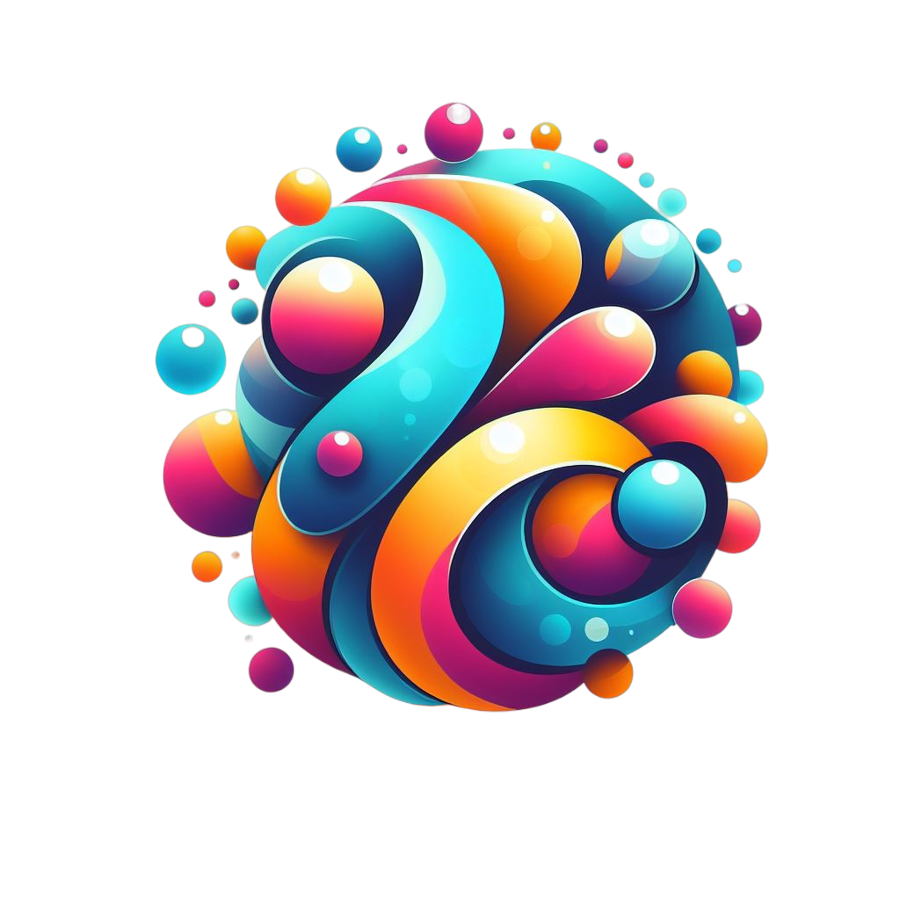

[![Forks][forks-shield]][forks-url]
[![Stargazers][stars-shield]][stars-url]

<div align="center">
  <a href="https://github.com/VictorGoubet/Bubble">
    
  </a>

  <h3 align="center">Bubble</h3>

  <p align="center">
    <i>Exploring OpenGL and Vispy through Bubble Interactions</i>
    <br />
    <a href="https://github.com/VictorGoubet/Bubble"><strong>Explore the docs »</strong></a>
    <br />
    <br />
    <a href="https://github.com/VictorGoubet/Bubble/issues">Report Bug</a>
    •
    <a href="https://github.com/VictorGoubet/Bubble/issues">Request Feature</a>
  </p>
</div>

## About The Project

The "Bubble" project is more than a mere simulation; it's an experimental foray into OpenGL and Vispy, aiming to create a visually appealing interaction of bubbles in a 2D space. The physical concepts in this simulation are largely approximated, serving as a learning and exploration platform rather than a precise physical simulation.

[![Product Screen Shot][product-screenshot]](https://github.com/VictorGoubet/Bubble)

The bubbles interact through a simplified physics model, where collisions can result in bubbles splitting based on an approximated energy transfer model. This approach, while not physically accurate, provides an interesting and aesthetically pleasing visual display of interacting bubbles, offering a foundation upon which further refinements and features can be built.

### Built With

- [Python](https://www.python.org/)
- [OpenGL](https://www.opengl.org/)
- [Vispy](https://github.com/vispy/vispy)

## Getting Started

### Prerequisites

- Python 3.x
- pip

### Installation

1. Clone the repository:
   ```bash
   git clone https://github.com/VictorGoubet/Bubble
   cd Bubble
   ```
2. Set up a virtual environment (recommended):
   ```bash
   python3 -m venv venv
   source venv/bin/activate
   ```
3. Install the required dependencies:
   ```bash
   pip install -r requirements.txt
   ```
4. Run the simulation:
   ```bash
   python3 simulation.py
   ```

## Hyperparameters

Several hyperparameters govern the behavior and visual appearance of the simulation and bubbles:

### Simulation Hyperparameters (Located in `simulation.py`)

- **`n`**: Number of bubbles in the simulation.
- **`width`** & **`height`**: Width and height of the simulation window.
- **`min_radius`** & **`max_radius`**: Minimum and maximum allowable radii for the bubbles.
- **`max_speed`**: Maximum allowable speed for the bubbles.
- **`mode`**: Interaction mode ("split", "merge", "overlap", or "bounce").

### Bubble Hyperparameters (Located in `bubble.py`)

- **`density`**: Density of the bubbles, affecting their weight.
- **`max_speed`**: Maximum speed of a bubble.

## Simulation Details

### Bubble Splitting Mechanism

In the context of a collision, kinetic energy is transferred between bubbles. Each bubble has a resistance, and if the energy transferred surpasses this resistance, the bubble "breaks", splitting into two smaller bubbles. New properties (e.g., radius, position, and speed) for the resulting bubbles are calculated, maintaining a semblance of energy conservation in the system.

## Future Improvements

- **Bubble Merging**: Implement a "merge" mode, where bubbles coalesce like water bubbles, forming larger structures instead of splitting.


## Contact

Victor Goubet - [LinkedIn][linkedin-url] - victorgoubet@orange.fr

---


[product-screenshot]: static/screenshot.png
[linkedin-url]: https://linkedin.com/in/victorgoubet
[forks-shield]: https://img.shields.io/github/forks/VictorGoubet/Bubble.svg?style=for-the-badge
[forks-url]: https://github.com/VictorGoubet/Bubble/network/members
[stars-shield]: https://img.shields.io/github/stars/VictorGoubet/Bubble.svg?style=for-the-badge
[stars-url]: https://github.com/VictorGoubet/Bubble/stargazers
